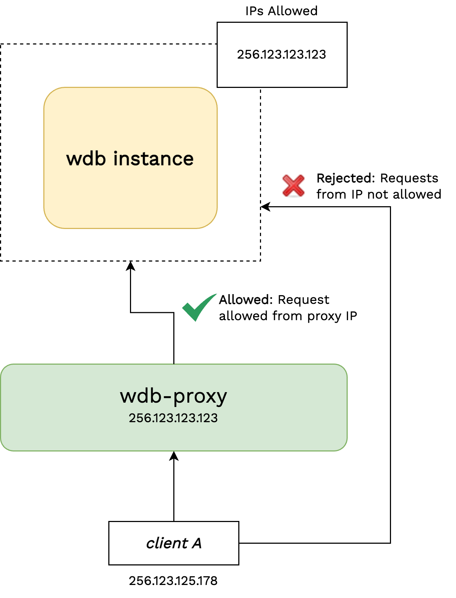

# wdb-proxy

A web-service to act as proxy to hosted wunderDb instance. All requests sent to wdb-proxy service are forwarded to the running wdb-instance and response from it is sent back to the requester. wdb-proxy also helps in securing the original wdb-instance from being open to the internet.

## Usage

This service is built with python flask web service that required 3 configurations to be set in a `.env` file.

| Variable Name | Description | Value |
| ------------- | ----------- | ----- |
| FORWARD_TO_HOST  | Address/URL of the wdb instance HOST to forward request to. | <http://localhost:8080> |
| PROXY_APPLICATION | Name/Identifier of the proxy service | wunder-proxy |
| PROXY_PORT | Port on which the flask app should run | 5001 |
| REMOVE_HOST_PATH | Sub-route to remove from URL along with proxy host address | `v1/` |

Refer to the sample environment file [here](./.env).

## Architecture

